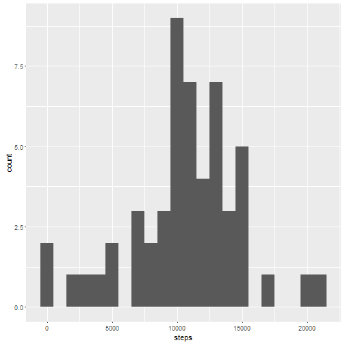
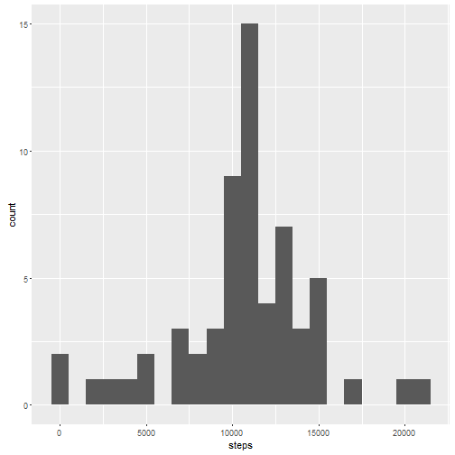
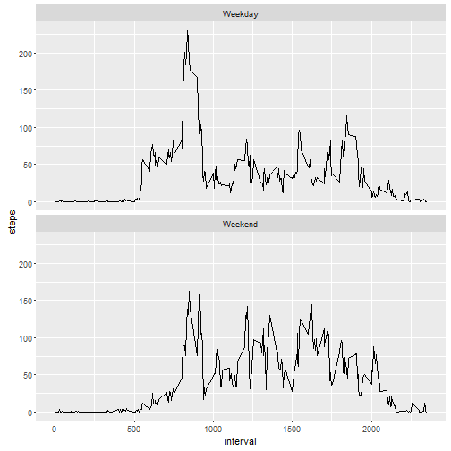

## Introduction

This assignment makes use of data from a personal activity monitoring device. This device collects data at 5 minute intervals through out the day. The data consists of two months of data from an anonymous individual collected during the months of October and November, 2012 and include the number of steps taken in 5 minute intervals each day.

This document presents a series of analysis performed on the data as required by the Reproducible Research assignment 1.

## Loading and Preprocessing the Data

### Load the Data

This section of the document covers the first step of the analysis which is to read the data into R.


```r
input.1<-read.csv("../Input/activity.csv")
str(input.1)
```

```
## 'data.frame':	17568 obs. of  3 variables:
##  $ steps   : int  NA NA NA NA NA NA NA NA NA NA ...
##  $ date    : Factor w/ 61 levels "2012-10-01","2012-10-02",..: 1 1 1 1 1 1 1 1 1 1 ...
##  $ interval: int  0 5 10 15 20 25 30 35 40 45 ...
```

### Process/Transform the Data

Note that the date column has been read in as a character data type.  This should be changed to a Date datatype.


```r
input.1$date<-as.Date(input.1$date)
str(input.1)
```

```
## 'data.frame':	17568 obs. of  3 variables:
##  $ steps   : int  NA NA NA NA NA NA NA NA NA NA ...
##  $ date    : Date, format: "2012-10-01" "2012-10-01" ...
##  $ interval: int  0 5 10 15 20 25 30 35 40 45 ...
```

See that the date column is now of Data type.

## What is the Mean Total Number of Steps Taken Per Day?

###Calculate the total number of steps taken per day

For this we will use the aggregate function to group the steps (summing them) over the dates specified in the dates column.


```r
steps.per.day.sum.1<-aggregate(steps ~ date, input.1, sum, na.rm = TRUE)
str(steps.per.day.sum.1)
```

```
## 'data.frame':	53 obs. of  2 variables:
##  $ date : Date, format: "2012-10-02" "2012-10-03" ...
##  $ steps: int  126 11352 12116 13294 15420 11015 12811 9900 10304 17382 ...
```

```r
head(steps.per.day.sum.1)
```

```
##         date steps
## 1 2012-10-02   126
## 2 2012-10-03 11352
## 3 2012-10-04 12116
## 4 2012-10-05 13294
## 5 2012-10-06 15420
## 6 2012-10-07 11015
```

See that we now have a data frame with 2 columns, date and the total number of steps for that date.

### Make a histogram of the total number of steps taken each day

The following command renders the histogram with binwidth of 1000.


```r
ggplot(data = steps.per.day.sum.1, aes(steps)) + geom_histogram(binwidth = 1000)
```



### Calculate and report the mean and median of the total number of steps taken per day


```r
steps.per.day.mean.1<-mean(steps.per.day.sum.1$steps)
steps.per.day.mean.1
```

```
## [1] 10766.19
```

```r
steps.per.day.median<-median(steps.per.day.sum.1$steps)
steps.per.day.median
```

```
## [1] 10765
```

The mean and median steps of the current data is shown to be 10766.19 and 10765 respectively.

##What is the average daily activity pattern?

###Make a time series plot


```r
steps.per.interval.average.1<-aggregate(steps ~ interval, input.1, mean, na.rm = TRUE)
str(steps.per.interval.average.1)
```

```
## 'data.frame':	288 obs. of  2 variables:
##  $ interval: int  0 5 10 15 20 25 30 35 40 45 ...
##  $ steps   : num  1.717 0.3396 0.1321 0.1509 0.0755 ...
```


```r
ggplot(data = steps.per.interval.average.1, aes(x=interval, y=steps)) + geom_line()
```


###Which 5-minute interval contains the maximum number of steps?


```r
steps.per.interval.average.1[which.max(steps.per.interval.average.1$steps),]
```

```
##     interval    steps
## 104      835 206.1698
```

The data shows that interval 835 has the highest average steps.

## Imputing Missing Values

### Calculate and report the total number of missing values in the dataset 

Lets look at where we have missing values in the data


```r
summary(input.1)
```

```
##      steps             date               interval     
##  Min.   :  0.00   Min.   :2012-10-01   Min.   :   0.0  
##  1st Qu.:  0.00   1st Qu.:2012-10-16   1st Qu.: 588.8  
##  Median :  0.00   Median :2012-10-31   Median :1177.5  
##  Mean   : 37.38   Mean   :2012-10-31   Mean   :1177.5  
##  3rd Qu.: 12.00   3rd Qu.:2012-11-15   3rd Qu.:1766.2  
##  Max.   :806.00   Max.   :2012-11-30   Max.   :2355.0  
##  NA's   :2304
```

From the summary, its just the steps column that is missing 2304 values (NA's)

###Devise a strategy for filling in all of the missing values in the dataset

For missing values, lets take the average for the interval that is missing.

###Create a new dataset that is equal to the original dataset with the missing data filled in.


```r
input.2 <- input.1
nas <- is.na(input.2$steps)
avg_interval <- tapply(input.2$steps, input.2$interval, mean, na.rm=TRUE, simplify=TRUE)
input.2$steps[nas] <- avg_interval[as.character(input.2$interval[nas])]
summary(input.2)
```

```
##      steps             date               interval     
##  Min.   :  0.00   Min.   :2012-10-01   Min.   :   0.0  
##  1st Qu.:  0.00   1st Qu.:2012-10-16   1st Qu.: 588.8  
##  Median :  0.00   Median :2012-10-31   Median :1177.5  
##  Mean   : 37.38   Mean   :2012-10-31   Mean   :1177.5  
##  3rd Qu.: 27.00   3rd Qu.:2012-11-15   3rd Qu.:1766.2  
##  Max.   :806.00   Max.   :2012-11-30   Max.   :2355.0
```

Not the summary now shows no NA values for any column.

### Make a histogram of the total number of steps taken each day

For this we will use the aggregate function to group the steps (summing them) over the dates specified in the dates column.


```r
steps.per.day.sum.2<-aggregate(steps ~ date, input.2, sum, na.rm = TRUE)
str(steps.per.day.sum.2)
```

```
## 'data.frame':	61 obs. of  2 variables:
##  $ date : Date, format: "2012-10-01" "2012-10-02" ...
##  $ steps: num  10766 126 11352 12116 13294 ...
```

```r
head(steps.per.day.sum.2)
```

```
##         date    steps
## 1 2012-10-01 10766.19
## 2 2012-10-02   126.00
## 3 2012-10-03 11352.00
## 4 2012-10-04 12116.00
## 5 2012-10-05 13294.00
## 6 2012-10-06 15420.00
```


```r
ggplot(data = steps.per.day.sum.2, aes(steps)) + geom_histogram(binwidth = 1000)
```



###Calculate and report the mean and median total number of steps taken per day


```r
steps.per.day.mean.2<-mean(steps.per.day.sum.2$steps)
steps.per.day.mean.2
```

```
## [1] 10766.19
```

```r
steps.per.day.median.2<-median(steps.per.day.sum.2$steps)
steps.per.day.median.2
```

```
## [1] 10766.19
```

With the new data set having no NA values, the new mean and median are now exactly the same value, at 10766.19.

## Are there differences in activity patterns between weekdays and weekends?

###Create a new factor variable with two levels - "weekday" and "weekend"

Add a new column to the full data set using the weekday() function and then use this to determine whether the day is on a weekend or weekday.


```r
input.2$Weekday<-weekdays(input.2$date)
input.2$DayType<-ifelse(input.2$Weekday == "Saturday" | input.2$Weekday == "Sunday", "Weekend", "Weekday")
```

Now summarize the data


```r
steps.per.interval.average.2<-aggregate(steps ~ interval + DayType, input.2, mean, na.rm = TRUE)
str(steps.per.interval.average.2)
```

```
## 'data.frame':	576 obs. of  3 variables:
##  $ interval: int  0 5 10 15 20 25 30 35 40 45 ...
##  $ DayType : chr  "Weekday" "Weekday" "Weekday" "Weekday" ...
##  $ steps   : num  2.251 0.445 0.173 0.198 0.099 ...
```

###Make a panel plot


```r
ggplot(data = steps.per.interval.average.2, aes(x=interval, y=steps)) +
                      geom_line() +
                      facet_wrap(~DayType, ncol = 1, nrow = 2)
```



There are several things that can be seen from the weekend versus weekday data.  Firstly, the steps begin to ramp up in the morning on a weekend later than they do on a weekday.  Secondly, there is generally higher volume of steps on a weekend versus weekday.

